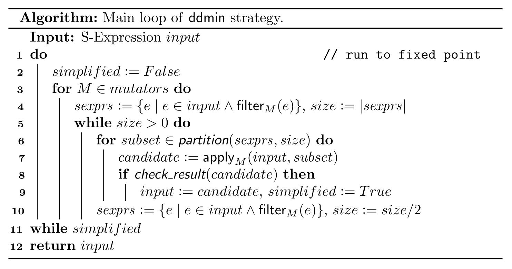
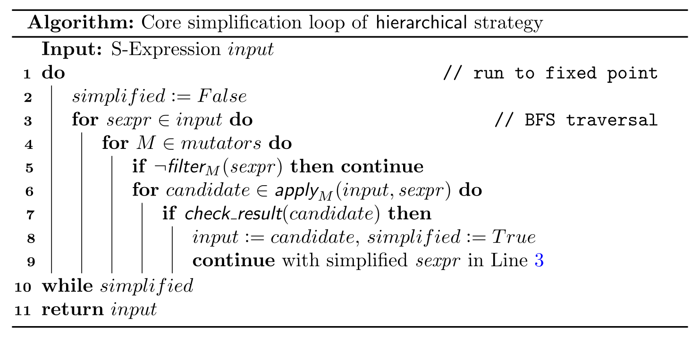

Minimization Strategies
=======================

**ddSMT** implements two fundamentally different strategies for input
minimization (**ddmin** and **hierarchical**), which can be combined
into the best of both worlds, strategy **hybrid**.

Strategy **ddmin** implements a variant of the minimization strategy from
:cite:`Zeller1999`, and is the direct successor of what the original **ddSMT**
from :cite:`Niemetz2013` implemented: it tries to perform mutations on multiple
S-expressions in the input in parallel.
Strategy **hierarchical** performs a simple breadth-first traversal through the
input and applies mutations to every S-expression, one mutation at a time
(similar to what is presented as "hierarchical delta-debugging" in
:cite:`Brummayer2009`).
Strategy **hybrid** is the **default** strategy of **ddSMT**.
It first applies **ddmin** until a fixed point is reached, and then calls
strategy **hierarchical** on the simplified input.

For a more in-depth analysis of these minimization strategies, see
:cite:`Kremer2021`.

.. _ddmin-strategy:

The **ddmin** Strategy
----------------------

Strategy **ddmin** tries to perform simplifications on multiple S-expressions
in the input in parallel.
The algorithm below shows the main loop of **ddmin** in pseudo code.
For each active mutator :code:`M`, the algorithm first collects all
S-expressions in the input that can be simplified by :code:`M` (Line 4).
Simplifications are applied and checked in a fashion similar to the original
`ddmin` algorithm :cite:`Zeller2002`:

* the set of S-expressions :code:`sexprs` is partitioned into subsets of size
  :code:`size`
* each S-expression :code:`e` from :code:`subset` is substituted in the current
  :code:`input` (Line 7) with a simplification suggested by mutator :code:`M`
* the resulting simplified input candidate is then checked if it still triggers
  the original behavior from the golden run (Line 8)

Once all subsets of a given size are checked, :code:`sexprs` is updated based
on the current input and partitioned into smaller subsets.
As soon as all subsets of size 1 were checked, these steps are repeated
with the next mutator.
This loop is run until the input cannot be further simplified.

**ddmin** applies mutators in two  stages.  The  first stage  targets
top-level  S-expressions  (e.g., specific kinds of SMT-LIB commands) until a
fixed point to aggressively simplify the input before applying more expensive
mutators in the second stage.

The **hierarchical** Strategy
-----------------------------

The main loop of the **hierarchical** strategy (as shown in pseudo code below)
performs a simple breadth-first traversal
of the S-expressions in the input, and applies all enabled mutators
to every S-expression.
Once a simplification is found (Line 7), all pending checks for the current
S-expression are aborted and the breadth-first traversal continues with the
simplified S-expression :code:`sexpr` (Line 9).
This process is repeated until further simplifications are found.

The main simplification loop (Line 3) is applied multiple times, with varying
sets of mutators.
In the initial stages, **hierarchical** aims for aggressive minimization
using only a small set of selected mutators, in the next-to-last stage it
employs all but a few mutators that usually only have cosmetic impact, and in
the last stage it includes all mutators.

Breadth-first traversal yields significantly better results than a depth-first
traversal, most probably since it tends to favor simplifications on larger
subtrees of the input.

The **hybrid** Strategy
-----------------------

Strategy **hybrid** is the **default** strategy of **ddSMT**.
It combines strategies **ddmin** and **hierarchical** in a sequential
portfolio manner for a best of both worlds.

Strategy **hybrid** first applies **ddmin** until a fixed point is reached, and
then calls strategy **hierarchical** on the simplified input.
This order of strategies is due to our observation that **ddmin**
is usually faster in simplifying input, while **hierarchical** often
yields smaller inputs.
